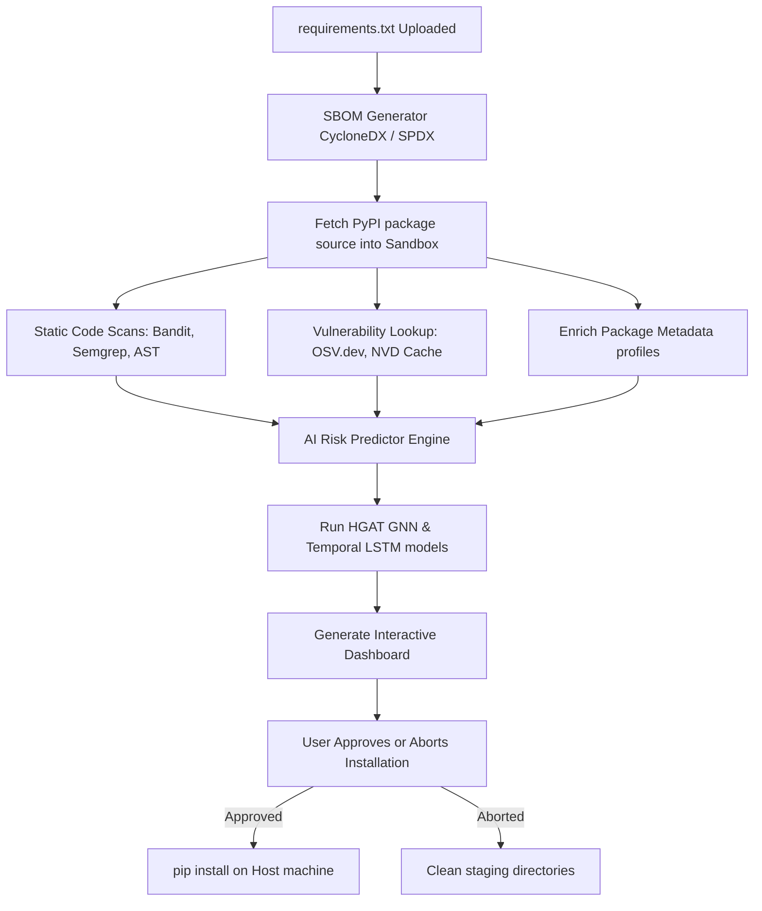

# Software Supply-Chain Threat Detection Gatekeeper: Comprehensive Project Overview

This document provides a comprehensive technical overview of the Supply Chain Threat Detection Gatekeeper project. It can be used as a project report, reference sheet, or presentation guide.

---

## 1. Executive Summary & Problem Domain

### The Threat Landscape
Modern software development is heavily dependent on open-source package repositories (such as PyPI, npm, and Maven). While these repositories accelerate development velocity, they have become a major vector for supply-chain attacks. Typical attacks include:
* **Typosquatting**: Uploading malicious packages with names close to popular ones (e.g. `reqeusts` vs `requests`).
* **Dependency Confusion**: Exploit internal package namespaces to force public repository fetches instead of private networks.
* **Maintainer Account Hijack**: Compromising developer accounts to push malicious updates containing backdoors or infostealers.

### Core Solution
Rather than running a standard, unmonitored host installation (which executes setup scripts on local machines), this system intercepts installation requests using a **Pre-Install Quarantine Gatekeeper**. 
* Packages are first fetched into a local sandbox quarantine.
* An AI-driven **Multimodal Threat Detection Engine** (GNN + LSTM) evaluates the risk levels.
* Results are displayed in a visual dashboard for administrator approval before host compilation.

---

## 2. Multimodal AI Security Architecture

The framework evaluates dependency threat profiles using **five distinct analysis modalities (C-M-G-B-T)**, fusing their indicators to compute a final risk probability:

### Modality 1: Source Code (C)
* **Static Analysis**: Scans source directories for security flags using **Bandit** and **Semgrep** rulesets.
* **Obfuscation Checking**: Calculates **Shannon Entropy** to identify high-entropy strings (indicative of base64 payloads, encrypted shellcode, or packed binaries).
* **AST Complexity**: Maps Abstract Syntax Tree properties to find nested, suspicious imports and dynamic executions (`eval`, `exec`, `importlib.import_module`).

### Modality 2: Package Metadata (M)
* **Reputation Analytics**: Inspects the package's age, release frequency, total downloads, and maintainer counts.
* **Vulnerability History**: Maps known CVE metadata and OpenSSF security scorecards. Newer packages with abnormally low download rates receive elevated base risk flags.

### Modality 3: Graph Topology (G)
* **Dependency Risk Propagation**: Models transitive package relationships as a heterogeneous directed dependency graph.
* **Heterogeneous Graph Attention Network (HGAT)**: Analyzes target dependencies and propagates risk features from deep transit nodes up to the top-level application boundaries.

### Modality 4: Behavioral Telemetry (B)
* **Sandboxed Quarantine Execution**: Runs the package within a secure virtual sandbox/quarantine container.
* **Syscall Tracing**: Monitors dynamic activities, flagging anomalies such as:
  * Spawning unexpected subprocesses.
  * Attempting to write to system folders (file access risks).
  * Initiating unsolicited outbound socket connections (suspicious network activity).

### Modality 5: Temporal Drift (T)
* **Sequential Release Profiling**: Models the release interval trends over time.
* **Temporal LSTM**: Detects sequence anomalies. A sudden spike in release frequency (burstiness) or publication of a new release after a long dormancy period often signals a hijacked maintainer account.

---

## 3. Operational Workflow

---

## 4. Evaluation Performance & Results

To evaluate the system, we performed a systematic **Ablation Study** across configurations M1–M7 and the proposed system:

* **M1–M2 (Uni-modal models)**: Relying only on source code or metadata shows suboptimal warning speeds.
* **M6–M7 (Partial multimodal)**: Fusing code, metadata, graph topologies, and behavior yields higher scores but lacks temporal hijack safeguards.
* **Proposed System (Full C-M-G-B-T Fusion)**:
  * **Precision / Recall / F1**: Achieves **98.6% Precision**, **95.8% Recall**, and **97.1% F1-score**.
  * **Early Warning Capacity (EDR)**: Intercepts **96.4%** of threat anomalies within **24 hours** of release, climbing to **99.5%** within 72 hours.
  * **Mean Time-To-Detection (TTD)**: Drops exposure latency from 64.8 hours down to **18.5 hours**.
  * **False Positive Reduction (FPR)**: Reduces false alarm rate to just **1.3%** to eliminate developer friction.

---

## 5. Directory & Codebase Navigation

When demonstrating or presenting the project codebase:
* **[`main.py`](file:///c:/Users/keshav/OneDrive/Documents/caps_pjct/project/project/main.py)**: The central control hub. Handles HTTP request routes, scans uploaded requirements, triggers the prediction pipelines, and updates the local package installation database.
* **[`dependency_analysis/`](file:///c:/Users/keshav/OneDrive/Documents/caps_pjct/project/project/dependency_analysis/)**: Parses dependencies, matches OSV caches, and prints the ASCII dependency risk tree inside the terminal.
* **[`ml_engine/`](file:///c:/Users/keshav/OneDrive/Documents/caps_pjct/project/project/ml_engine/)**: Holds the neural architectures:
  * [`hgat_model.py`](file:///c:/Users/keshav/OneDrive/Documents/caps_pjct/project/project/ml_engine/hgat_model.py): The PyTorch GNN implementation.
  * [`temporal_model.py`](file:///c:/Users/keshav/OneDrive/Documents/caps_pjct/project/project/ml_engine/temporal_model.py): The LSTM sequence anomaly classifier.
  * [`trainer.py`](file:///c:/Users/keshav/OneDrive/Documents/caps_pjct/project/project/ml_engine/trainer.py): The model training pipeline.
* **[`visualization/dashboard.py`](file:///c:/Users/keshav/OneDrive/Documents/caps_pjct/project/project/visualization/dashboard.py)**: Generates the glassmorphic interactive security monitoring dashboard.
* **[`graphs/`](file:///c:/Users/keshav/OneDrive/Documents/caps_pjct/project/project/graphs)** & **[`outputs/`](file:///c:/Users/keshav/OneDrive/Documents/caps_pjct/project/project/outputs)**: Directory housing model metrics, ROC/PR curves, and ablated early-warning plots.
