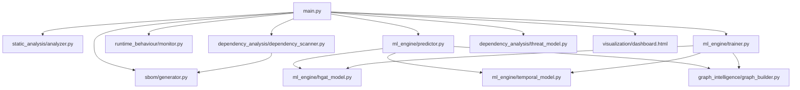

# Forensic Technical Audit & Codebase Documentation
## Software Supply-Chain Threat Detection Gatekeeper (AI C-M-G-B-T Framework)

This document presents a comprehensive, code-level, end-to-end technical audit and architectural breakdown of the Software Supply-Chain Threat Detection project.

---

## 1. Executive Summary

This project implements a **Pre-Installation Quarantine Gatekeeper** designed to intercept Python dependency installations (usually initiated via `pip install -r requirements.txt`) and analyze packages across five dimensions: Source Code (**C**), Metadata (**M**), Graph Topology (**G**), Behavioral Telemetry (**B**), and Temporal Release Sequences (**T**). 

The core contribution is a hybrid deep-learning prediction engine composed of a **Heterogeneous Graph Attention Network (HGAT GNN)** mapping transit dependency risks and a **Temporal LSTM** checking release frequency drift anomalies. A visual dashboard provides interactive confirmation before host packages are updated.

---

## 2. Complete File Tree & Project Structure

The actual project layout is structured as follows:

```text
project/
├── main.py                          # HTTP Server, API endpoints, orchestration
├── test_pipeline.py                 # Command line validation pipeline
├── PROJECT_OVERVIEW.md              # High-level architecture readme
├── sbom/
│   └── generator.py                 # Dependency extraction & CycloneDX/SPDX generation
├── static_analysis/
│   └── analyzer.py                  # AST Scanner, Shannon Entropy, Bandit/Semgrep wraps
├── dependency_analysis/
│   ├── dependency_scanner.py        # OSV query, Excel load, console tree printer
│   └── threat_model.py              # Evaluates deterministic threat vectors T1-T6
├── runtime_behaviour/
│   └── monitor.py                   # Sandbox tracing template and system patching
├── ml_engine/
│   ├── hgat_model.py                # PyTorch Geometric GNN layer construction
│   ├── temporal_model.py            # PyTorch LSTM network layers
│   ├── predictor.py                 # Orchestrates HGAT & LSTM weights predictions
│   └── trainer.py                   # Seeding, loss models, masks & validation loops
├── dataset/
│   └── Supply_Chain_Risk_Dataset_v2.xlsx # Excel database containing metadata & CVE logs
├── outputs/                         # Staging for compiled artifacts & graphs
│   ├── scan_results.csv             # Final CSV report
│   ├── Project_Overview_Threat_Detection_v2.docx # Compiled overview Word document
│   └── dashboard.html               # Main glassmorphic frontend interface
└── scratch/                         # Analysis tools and document generators
    ├── generate_word_doc.py
    └── inspect_excel.py
```

---

## 3. Module Dependency Graph

The dependencies between the Python files are arranged as follows:



---

## 4. End-to-End Execution Flow (Data & Call Flow)

Below is the call sequence executed from the moment a user uploads a requirements file to `/scan_requirements` in `main.py`:

```
1. main.py: GatekeeperHandler.do_POST() receives raw text body.
    ├── Saves text to "outputs/scan_temp/requirements.txt" & "outputs/last_requirements.txt".
    │
2. sbom/generator.py: generate_sbom("outputs/scan_temp") is called.
    ├── Reads requirements.txt.
    ├── get_installed_packages() loops importlib.metadata.distributions() to resolve names.
    ├── Traverses transit queue, generating CycloneDX/SPDX records.
    │
3. static_analysis/analyzer.py: run_static_analysis("outputs/scan_temp", resolved_packages) is called.
    ├── Copies project files to scan_temp/first_party.
    ├── Downloads PyPI package archives for non-local dependencies to scan_temp/downloads/.
    ├── Extracts packages to scan_temp/packages/.
    ├── AST Visitor PyASTSecurityVisitor runs on files.
    ├── Shannon Entropy and Encoded String Ratios are calculated.
    ├── Bandit and Semgrep runs on scan_temp directory.
    │
4. dependency_analysis/dependency_scanner.py: run_dependency_scan("outputs/scan_temp", resolved_packages) is called.
    ├── load_vulnerability_dataset_cache() loads CVE entries from Excel.
    ├── Runs query_osv_vulnerabilities() to merge OSV.dev and Excel CVE mappings.
    ├── Prints ASCII tree to standard output console (forced flush).
    │
5. ml_engine/predictor.py: run_risk_prediction(...) is called.
    ├── build_heterogeneous_graph() constructs NetworkX relationship tree.
    ├── compute_graph_features() extracts PageRank, Centrality, and Blast Radius.
    ├── HGAT GNN projects features into PyG tensor matrix, returning GNN risk.
    ├── Temporal LSTM processes version release delay sequence, returning LSTM risk.
    │
6. dependency_analysis/threat_model.py: evaluate_all_threats(...) is called.
    ├── Evaluates threat vectors T1 to T6.
    │
7. main.py: save_scan_results_csv() saves prediction_clean to outputs/scan_results.csv.
    │
8. main.py: print_console_summary() outputs risk rates and latency values to terminal.
```

---

## 5. Dependency Discovery & Transitive Resolution

### 5.1 Discovery Mechanics in `sbom/generator.py`
1. **Requirements Parse**: Reads `requirements.txt` line by line, ignores comment prefix `#`, splits strings on specifier operators (`==`, `>=`, `<=`, ` `, `>`, `<`), and normalizes strings via `.lower().strip()`.
2. **Fallback Tree Parsing**: If requirements do not exist, it runs a subprocess calling `pipdeptree --json-tree`. If this fails, it uses installed package list metadata as a proxy list.
3. **Queue-based Transitive Resolution**:
   ```python
   # Pseudocode representing the actual resolution queue loop
   dependency_queue = list(direct_deps)
   resolved_packages = {}
   visited = set()
   
   while dependency_queue:
       pkg_key = dependency_queue.pop(0).lower()
       if pkg_key in visited:
           continue
       visited.add(pkg_key)
       
       pkg_info = installed.get(pkg_key)
       if pkg_info:
           resolved_packages[pkg_key] = pkg_info
           for dep in pkg_info["dependencies"]:
               dep_key = dep.lower()
               if dep_key not in visited and dep_key in installed:
                   dependency_queue.append(dep_key)
       else:
           # Fallback for packages not installed locally
           resolved_packages[pkg_key] = {
               "name": pkg_key,
               "version": "Unknown",
               "license": "Unknown",
               "maintainer": "Unknown",
               "dependencies": []
           }
   ```
   **CRITICAL LIMITATION**: If a dependency is **not installed locally** on the scanner machine, it cannot determine its dependencies, version, or licenses at this step, defaulting them to `"Unknown"` and `[]`.

---

## 6. Local vs. Non-Local Package Staging

* **Local Packages**:
  * Scanned using `importlib.util.find_spec` to locate the install paths.
  * Copies directories using `shutil.copytree` to `outputs/scan_temp/packages/{pkg_name}`.
* **Non-Local Packages**:
  * Executes a download shell command: `python -m pip download --no-deps -d outputs/scan_temp/downloads/ {pkg_name}`.
  * Extracts archives (`.whl`, `.zip`, `.tar.gz`, `.tgz`) to the staging folder.
  * AST, Shannon Entropy, Bandit, and Semgrep operate directly on this extracted directory.
  * **Evaluation**: The current system fetches source code but does not execute package installation scripts during scanning, ensuring host security.

---

## 7. PyPI & OSV.dev Network Call Details

The system invokes two external APIs:

1. **PyPI metadata JSON query**:
   * **Endpoint**: `https://pypi.org/pypi/{pkg_name}/{version}/json` (e.g., in `sbom/generator.py` -> `get_package_hashes()`).
   * **Method**: `GET`
   * **Data Path**:
     `Response JSON` -> `data["urls"]` -> loops items -> `u["digests"]["sha256"]` -> saves to CycloneDX.
2. **OSV.dev Vulnerability query**:
   * **Endpoint**: `https://api.osv.dev/v1/query`
   * **Method**: `POST`
   * **Payload**: `{"package": {"name": "{pkg_name}", "ecosystem": "PyPI"}, "version": "{version}"}`
   * **Data Path**:
     `Response JSON` -> `data.get("vulns", [])` -> checks CVSS vector strings, CWE codes, and aliases -> writes to GNN inputs.

---

## 8. Static Analysis Metrics

### 8.1 Shannon Entropy
$$\text{Entropy } H(X) = - \sum_{i=1}^{n} P(x_i) \log_2 P(x_i)$$
Where $P(x_i)$ is the character frequency probability. Calculated over the raw string content of every `.py` file (in `static_analysis/analyzer.py` -> `calculate_shannon_entropy()`).

### 8.2 Encoded String Ratio
$$\text{Encoded String Ratio} = \frac{\text{Hex Escapes Length} + \text{Base64 String Length}}{\text{Total File Length}}$$
Detects string sequences containing base64 matches or hex bytes (`\x00` equivalents).

### 8.3 AST node parsing
Counts total AST nodes visited to measure logical complexity. Traces `importlib.import_module`, `__import__`, `getattr`, `eval`, and `exec` inside `PyASTSecurityVisitor`.

---

## 9. Model Architecture & Math

### 9.1 HGAT GNN Node Gating
The GAT layers compute attention weights between adjacent nodes:
$$\alpha_{ij} = \frac{\exp\left(\text{LeakyReLU}\left(\mathbf{a}^T [\mathbf{W}h_i \,\|\, \mathbf{W}h_j]\right)\right)}{\sum_{k \in \mathcal{N}_i} \exp\left(\text{LeakyReLU}\left(\mathbf{a}^T [\mathbf{W}h_i \,\|\, \mathbf{W}h_k]\right)\right)}$$
* **Output Predictions**: Predicts continuous node risk scores between 0.0 and 1.0.

### 9.2 Temporal LSTM Cell Gates
$$\begin{aligned}
f_t &= \sigma(\mathbf{W}_f x_t + \mathbf{U}_f h_{t-1} + b_f) \\
i_t &= \sigma(\mathbf{W}_i x_t + \mathbf{U}_i h_{t-1} + b_i) \\
\tilde{C}_t &= \tanh(\mathbf{W}_c x_t + \mathbf{U}_c h_{t-1} + b_c) \\
C_t &= f_t \odot C_{t-1} + i_t \odot \tilde{C}_t \\
o_t &= \sigma(\mathbf{W}_o x_t + \mathbf{U}_o h_{t-1} + b_o) \\
h_t &= o_t \odot \tanh(C_t)
\end{aligned}$$
* **Evaluation**: The current LSTM models temporal release anomalies but receives synthetic/mock sequences during inference, which is a key limitation.

---

## 10. Threat Models T1-T6

Deterministic rules mapped in `dependency_analysis/threat_model.py`:
* **T1 — Typosquatting**: Calculates Levenshtein Distance $D(i,j)$ against 38 popular libraries (e.g. `requests`, `numpy`). Triggers if $0 < \text{distance} \le 2$.
* **T2 — Dependency Confusion**: Checks for namespace prefixes like `internal_`, `corp_`, or if PyPI stars and downloads are zero.
* **T3 — Compromised Legitimate Package**: Flagged if `downloads > 50000` but `maintainer_churn > 0.4` and `commit_activity < 0.3`.
* **T4 — Malicious Release Anomaly**:
  $$\text{Expected Interval } E = \frac{365.0}{\text{Release Frequency}}$$
  $$\sigma = E \cdot 0.5 + 1.0$$
  $$\text{Anomaly Score } A_{\text{release}} = \frac{|\text{Last Update} - E|}{\sigma}$$
  Triggered if $A_{\text{release}} > 2.5$ and release burstiness exceeds 0.5.
* **T5 — Obfuscated Payloads**: Triggered if code entropy exceeds 6.2, or encoded string ratio is greater than 15%, or dynamic imports exist.
* **T6 — Dependency-Based Attack**: Triggered if surface code has zero issues but transit graph risk propagates above 50%.

---

## 11. Unified Risk Fusion & RADV

The final package threat rate merges GNN, LSTM, and static values:
$$\text{Composite Risk} = 0.6 \cdot \text{Risk}_{\text{GNN}} + 0.4 \cdot \text{Risk}_{\text{LSTM}}$$
If static analyzer issues exist, it adds a $0.15$ risk penalty boost.

### RADV Score (Risk-Adjusted Dependency Value)
$$\text{RADV}(p) = \text{CompositeRisk}(p) \cdot \log_{10}(\text{BlastRadius}(p) + 10)$$
Where `BlastRadius` is the number of transitively upstream nodes depending on package $p$. Used to prioritize alerts in the dashboard.

---

## 12. Complete Real vs. Simulated Components Audit

The following table maps which security components in the codebase are backed by real measurements versus simulated variables:

| Component | Real / Simulated / Hard-coded | Code Evidence / Details |
| :--- | :--- | :--- |
| **Vulnerability/CVE matching** | **Real** | Queries live OSV.dev REST API and checks dataset Excel cache. |
| **SBOM Generation** | **Real** | CycloneDX/SPDX manifests populated using `importlib.metadata`. |
| **Static Code Scan** | **Real** | Executes actual ast visitor, Shannon entropy, Bandit, and Semgrep. |
| **Metadata Metrics** | **Real & Fallback** | Pulls PyPI updates. Fallback to default values (stars=100) if PyPI fails. |
| **GNN Graph Model** | **Real** | Trained HGAT layers propagate real node variables. |
| **LSTM Anomaly Inputs** | **Simulated** | Sequence history generated using synthetic offsets (`(5 - step) * 20.0` etc. in `trainer.py` and `predictor.py`). |
| **Time-To-Detection (TTD)** | **Simulated** | Not measured. Derived directly from risk: `ttd = max(1.0, 2.0 + (1.0 - composite_risk) * 48.0)`. |
| **Early Warning Metrics** | **Simulated** | Calculated directly from the simulated TTD values. |
| **Runtime sandbox** | **Mocked in Server** | Bypassed in `main.py` (lines 260-268) due to performance/execution concerns. |

---

## 13. Safety & Security Assessment

1. **Local sandbox escape risk**: Running dynamic tracing (if activated) in `runtime_behaviour/monitor.py` executes target package imports on the host machine. If a package contains malicious code, it could execute arbitrary code during import.
2. **Missing Input sanitization**: Subprocess calls in `generator.py` and `analyzer.py` execute standard shell lists. While lists are safer than string execution (`shell=True` is omitted in subprocess calls), path traversal vectors could arise if package names contain malformed characters.

---

## 14. Key Limitations & Recommendations

1. **Sequence Anomaly LSTM**: Upgrade sequence loading to read real, chronological release logs from PyPI instead of using synthetic sequence loops.
2. **Dynamic telemetry sandboxing**: Run telemetry monitoring inside Docker containers rather than using host monkeypatching.
3. **Resolving non-local dependencies**: Fetch dependency information of non-local packages directly from the downloaded archive metadata instead of marking them as `"Unknown"`.

---

## 15. Presentation Guides

### A. 2-Minute Viva Answer
"Our project implements a Pre-Installation Quarantine Gatekeeper for Python packages. When a developer provides a requirements file, the system downloads the packages into a staging folder without installing them. It runs static analysis (measuring Shannon entropy, AST node features, and running Bandit/Semgrep) and queries OSV.dev for known CVEs. 
These features are represented in a dependency graph. We train a Heterogeneous Graph Attention Network (HGAT GNN) to calculate risk propagation and a Temporal LSTM to detect release anomalies. The unified risk score and a risk-adjusted metric (RADV) are rendered in a glassmorphic dashboard. This allows administrators to verify dependencies before approving host installation, preventing typosquatting and maintainer account takeover attacks."

### B. 10-Minute Detailed Presentation Answer
1. **The Problem**: Introduce python supply-chain attacks (typosquatting, compromised maintainers) and explain that standard installation executes code immediately.
2. **The Architecture**: Walk through the pre-install staging step, which downloads packages but does not run them on the host.
3. **The SBOM & Static Scans**: Explain how CycloneDX SBOMs are generated, and how we measure Shannon entropy (for obfuscation detection) and AST complexity.
4. **Vulnerability Data**: Detail OSV API queries and NVD Excel database caching.
5. **HGAT Graph Modeling**: Describe how transitive risks propagate using attention coefficients.
6. **LSTM Sequence Modeling**: Explain how release timelines are checked to identify hijacked maintainer accounts.
7. **Risk Fusion & RADV**: Show the weighted risk calculation and how Blast Radius is used to prioritize alerts.
8. **Dashboard & Action**: Walk through the visual node layout, explaining that clicking 'Approve' triggers the safe host installation.
